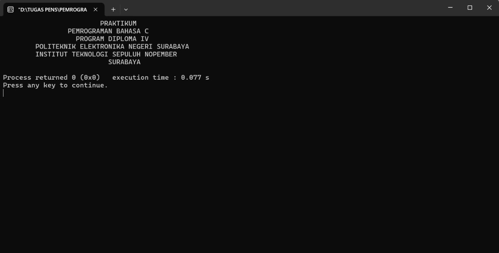

# Praktikum Pemrograman C

Repository ini berisi beberapa program sederhana untuk latihan dasar bahasa C.  
Setiap program memiliki tujuan berbeda, dan hasil outputnya ditampilkan pada gambar di bawah.

---

## Program 1-5-1
**Cara kerja:**  
Program ini menampilkan teks menggunakan tabulasi (`\t`) agar posisi tulisan terlihat rapi dan rata tengah di layar.  

📷 Output:  

---

## Program 1-5-2
**Cara kerja:**  
Program ini menggunakan `struct` untuk menyimpan data barang berupa nama, harga, dan diskon.  
Program kemudian menghitung harga setelah diskon untuk setiap barang, menampilkannya dalam tabel, dan menghitung total harga yang harus dibayar.  

📷 Output:  

---

## Program 1-5-5
**Cara kerja:**  
Program ini menerima input suhu dalam Celsius dari pengguna, lalu mengonversinya ke Fahrenheit dengan rumus:  

\[
fahrenheit = (celcius * 9 / 5) + 32
\]

Hasil konversi kemudian ditampilkan ke layar.  

📷 Output:  

